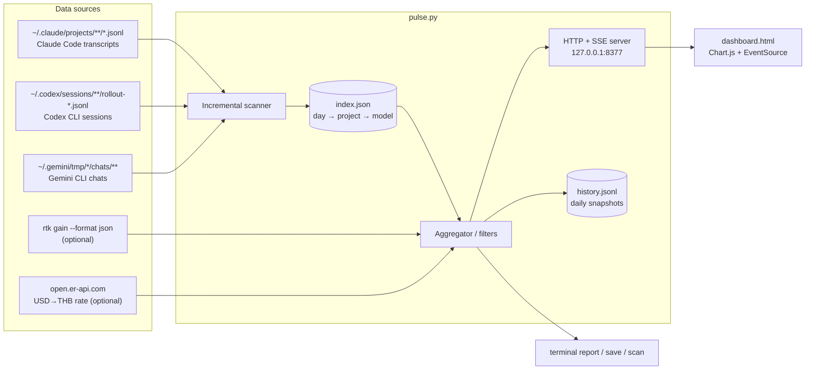

# Architecture Overview — AI Tokens Observability

A local-only observability tool for Claude Code token usage. Two files, zero
dependencies: `pulse.py` (collector + aggregator + HTTP/SSE server + CLI) and
`dashboard.html` (single-page frontend). This document explains how the
pieces fit together and why they're designed this way.

## System context



Everything runs on the developer's machine. The server binds to loopback
only; no usage data ever leaves the host (the only outbound calls are the
Chart.js CDN fetch by the browser and the FX rate lookup, both optional).

## Components

### 1. Incremental scanner — source adapters (`_scan_*`, `refresh_index`)

Usage data is collected through per-tool **adapters** that all normalize into
one event shape (`_emit`: ts, project, model, input, output, cache-write
5m/1h, cache-read):

| Adapter | Files | Parse strategy |
|---|---|---|
| `claude` | `~/.claude/projects/*/*.jsonl` | append-only JSONL, byte-offset cursor; dedupe on `requestId + message.id` |
| `codex` | `~/.codex/sessions/**/rollout-*.jsonl` | append-only JSONL; `token_count` events carry *cumulative* totals — usage is the delta vs the persisted previous total (robust to duplicate emissions); model/cwd tracked from `turn_context`/`session_meta` lines |
| `gemini-jsonl` | `~/.gemini/tmp/*/chats/*.jsonl` | append-only JSONL, one message per line with `tokens{input,output,cached,thoughts}` |
| `gemini-json` | `~/.gemini/tmp/*/chats/**/*.json` | whole-document rewrite; cursor is the consumed *message count* (messages are append-only within a session) |

For Codex and Gemini, `input` includes cached tokens, and reasoning/"thoughts"
tokens are billed as output — the adapters normalize both. Tools not installed
are skipped at discovery. A model's vendor (`model_source`) is inferred from
its id (claude-/gpt-/gemini-…), which powers the dashboard's tool filter
without any index change. The Claude Code adapter specifics:

- Tracks `(size, mtime, byte offset)` per file in the index; on each refresh
  it only reads **appended bytes** of files whose stat changed. A cold scan
  of ~300 MB takes <1 s; steady-state refreshes are near-free.
- Pre-filters lines with a cheap substring check (`"assistant"`, `"usage"`)
  before paying for `json.loads` — most transcript lines (user turns, tool
  results, attachments) are skipped without parsing.
- **Dedupes** multi-block assistant messages: the transcript repeats the same
  `usage` object on adjacent lines for one API response, so events are keyed
  by `requestId + message.id` and counted once.
- Handles partial trailing lines (a session mid-write) by re-reading them on
  the next pass, and triggers a full rebuild if a file ever shrinks.

### 2. The index (`~/.config/rtk-pulse/index.json`, version 2)

A single JSON document, written atomically (tmp + rename), guarded by a
process-wide lock:

```
{
  "version": 2,
  "files":    { path: {size, mtime, offset, key} },          // scan cursors
  "days":     { "YYYY-MM-DD": { project: { model: entry }}}, // aggregates
  "activity": { project: {ts, model, session} },             // last-seen
  "recent":   [ [ts, project, model, in, out, cache, cost] ] // ring buffer
}
```

- `entry` = `{in, out, cc5, cc1, cr, n, cost}` — input, output, 5-min/1-h
  cache writes, cache reads, message count, estimated USD.
- **`day → project → model` is the key design choice**: it is the minimal
  shape from which *any* combination of the three dashboard filters
  (project, model, time window) can be served without rescanning
  transcripts. Size stays small (≤90 days × ~tens of projects × ~6 models).
- `recent` is a 2-hour / 500-event ring buffer powering the live activity
  feed and tokens-per-minute chart.
- Days older than `KEEP_DAYS` (90) are pruned; long-term history lives in
  `history.jsonl` snapshots instead.
- A version bump (schema change) silently discards the old index and
  rebuilds — acceptable because rebuilds are sub-second.

### 3. Aggregator (`_agg`, `build_summary`)

Pure functions over the index. `build_summary(idx, project, model, days)`
produces the one JSON payload the frontend consumes: today + window totals,
per-day series (stacked by model), by-model and by-project rollups, cache
hit rate, live sessions, activity feed, per-minute throughput, dropdown
domains (`projects`, `models`), FX rate, and the rtk savings summary.

### 4. Cost model (`PRICING`, `cost_usd`)

API list prices per MTok, matched top-down by substring against the model
id (`fable` → $10/$50, `opus-4-8/7/6` → $5/$25, older `opus` → $15/$75,
`sonnet` → $3/$15, `haiku-4-5` → $1/$5 …). Cache reads cost 0.1× input;
cache writes 1.25× (5-min TTL) or 2× (1-h TTL) — the scanner uses the
transcript's `cache_creation` breakdown when present. Costs are **estimates
of equivalent API spend**, not subscription billing. Cost is computed once
at scan time and stored in the aggregates; currency conversion happens in
the frontend so switching USD/THB is instant.

### 5. HTTP + SSE server (`Handler`, `ThreadingHTTPServer`)

| Route | Purpose |
|---|---|
| `GET /` | serves `dashboard.html` from disk (always fresh — no rebuild step) |
| `GET /api/summary?project=&model=&source=&days=` | one filtered summary JSON |
| `GET /events?project=&model=&source=&days=` | SSE stream of filtered summaries |
| `GET /api/sessions?project=&source=` | recent sessions across tools (newest first) |
| `GET /api/trace?path=` | full trace of one session: prompts, assistant/thinking text, tool + MCP calls, tool results, per-call usage/cost. `path` must exactly match a discovered session file — anything else is rejected (no traversal). Traces are built on demand from the raw session file, not from the index; capped at the last 600 steps. |

The SSE loop polls a cheap filesystem fingerprint (file count + total size +
max mtime over the transcript tree) every 3 s; only when it changes does it
re-run the incremental scan and push a new summary. Keepalive comments go
out every 15 s. Filters ride on the EventSource URL, so each connected
client gets summaries matching its own filter state; the frontend reconnects
the stream whenever filters change.

### 6. Snapshots (`save_snapshot`, `history.jsonl`)

Append-only daily rollups (today's totals, 30-d cost, cache hit rate, rtk
saved). Written on `serve` start, every 30 min while serving, and on demand
via `pulse.py save` (e.g. from a Claude Code `SessionEnd` hook). This is the
durable record that outlives the 90-day index window.

### 7. FX resolver (`fx_thb`)

USD→THB with a strict fallback chain: `RTK_PULSE_THB` env override → fresh
disk cache (<12 h) → live API → stale cache → hardcoded 32.0. Also memoized
in-process for 10 min so offline machines don't pay a 5-s timeout per
summary.

### 8. Frontend (`dashboard.html`)

Single page, no build step, no framework. Chart.js from CDN; everything
else is vanilla JS (~250 lines).

- **State**: filters (project/model/days), currency, theme, live-on/off —
  the persistent ones in `localStorage`; one `lastSummary` object allows
  instant re-render on client-only changes (theme, currency).
- **Live updates**: `EventSource('/events?…')`; on filter change the stream
  is closed and reopened with new params. The live toggle simply
  disconnects/reconnects and hides the live row.
- **Theming**: `data-theme` attribute + CSS variable palettes, FOUC-safe
  inline bootstrap, `prefers-color-scheme` sync; chart colors are read from
  CSS variables on toggle, so charts re-skin with the page.

## Data flow (one live update)

```
Claude Code appends to a transcript
  → SSE loop notices fs fingerprint change      (≤3 s later)
  → refresh_index reads only the new bytes
  → build_summary aggregates with the client's filters
  → "data: {...}" pushed on the open SSE connection
  → render() updates cards, charts, tables in place
```

## Design decisions

| Decision | Rationale |
|---|---|
| stdlib only, two files | nothing to install or break; trivially auditable; runs anywhere Python 3.9 exists |
| derived index, transcripts as source of truth | the index is disposable cache — any corruption or schema change is fixed by a <1 s rebuild |
| precompute cost in USD at scan time, convert in UI | one scan pass; currency switch needs no server round-trip |
| SSE over WebSocket | one-directional push is all that's needed; SSE works with `http.server`, auto-reconnects in the browser, no extra deps |
| poll fs fingerprint instead of fswatch/inotify | portable, dependency-free, and 3 s latency is fine for a dashboard |
| filters server-side, cosmetics client-side | aggregation needs the full index; theme/currency are pure presentation |
| loopback bind only | usage data is sensitive (project names, spend); never exposed beyond the machine |

## Limitations / future ideas

- Costs assume API list prices; subscription plans (Pro/Max) bill differently.
- Per-minute feed only covers activity observed while the index is being
  refreshed (2-h ring buffer); it is not a full historical event log.
- Single-user, single-host by design. A multi-host setup would ship
  snapshots somewhere central rather than exposing the server.
- `history.jsonl` is collected but not yet visualized — a long-term trend
  page is a natural next step.
